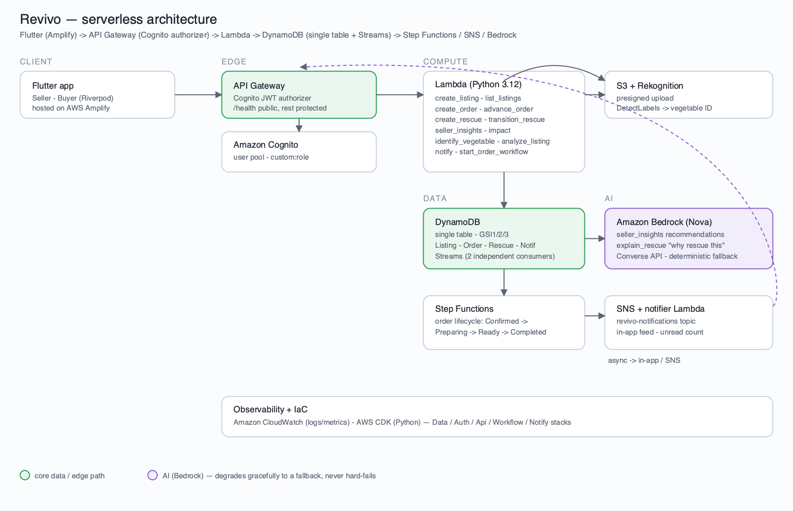
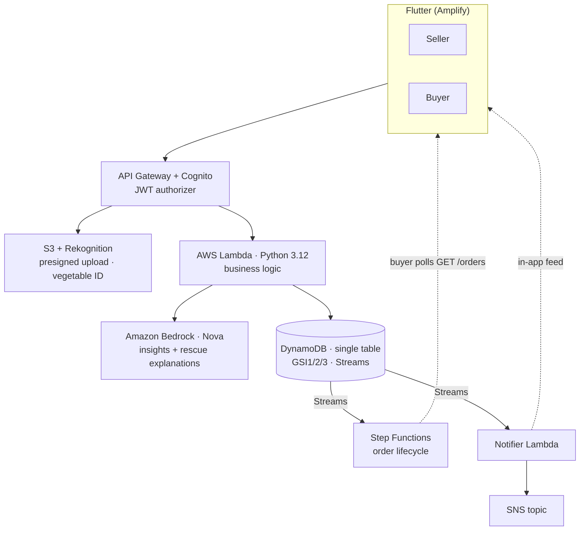

<div align="center">

# 🌱 Revivo

### A Time-Aware Food Recovery Network

**AI-powered surplus redistribution — Sell → Rescue → Transform**

*Technology races against the clock to save the food. Community turns saved food into a warm meal. Revivo does both.*

AWS Student Builder Group Hackathon 2026 · `#include 1.0` · Track: **SDG 2 — Zero Hunger & Sustainable Agriculture**

</div>

---

## 📖 Overview

**Revivo** connects vegetable vendors with nearby hotels and restaurants. It
treats every batch of surplus produce as a **degrading asset with a live
countdown** — freshness band and price both decay continuously from the
moment it's listed — and helps the vendor sell it before that window closes.

The platform operates through two layers, both grounded in the same live
freshness countdown:

| Layer | What happens |
|-------|--------------|
| **1 · Sell** | Vendor photographs surplus → Rekognition IDs it → freshness band + auto price → live on the buyer marketplace → order tracked through a real Step Functions lifecycle |
| **2 · Rescue** | Listings that would otherwise expire unsold are shown on a read-only Rescue board, routed to an NGO kitchen, each with a Bedrock-written "why rescue this" explanation |

Pilot: **Coimbatore** — seeded with a produce vendor (GreenLeaf Farms) and a
hotel buyer (Hotel Ashok) on the live AWS backend.

## ❗ Problem statement

India wastes **67 million tonnes of food annually** while **190 million people go hungry**. Vegetables lead the waste because of their short shelf life, and it starts with the last-mile vendor. Every evening, vendors discard edible produce while hotels 1–2 km away buy the same vegetables at full price — unaware surplus exists nearby. Existing platforms are static bulletin boards: they ignore perishability, don't escalate when selling fails, and never ensure rescued produce becomes a meal. **This is not a marketplace problem — it is a timing problem.**

## 💡 Solution

Revivo adds **time-awareness, automation, and measurement** to surplus redistribution:

- **Live freshness bands** (Good / Use Soon / Rescue) from a validated shelf-life database adjusted for storage condition — honest ranges, not false precision, recomputed from wall-clock time on every read.
- **A live marketplace, not a bulletin board** — prices decay with freshness in real time, identically on client and server, so what a buyer sees is what they pay.
- **A read-only Rescue network** for produce that would otherwise expire unsold, with a Bedrock-written explanation of why it should be rescued now.
- **Impact tracking & gamification** — personal impact cards, community leaderboard, milestone badges, sourced from FAO/UNEP-style conversion factors.

## ✨ Features

- Vendor listing flow: photo → **Rekognition** auto-ID → freshness band → auto price → publish
- Live freshness countdown with **real-time price decay** (`market × freshness factor`), identical client + server
- Buyer marketplace with per-vendor bands, dynamic prices, categories, filters, one-tap ordering
- Visible **Step Functions order lifecycle**: `Confirmed → Preparing → Ready → Completed`
- **AI insights (Bedrock Nova)** grounded in real seller data + a forward-looking **waste-risk projection** ("N kg reaches Rescue within 24h")
- Read-only **Rescue network** — surplus → NGO, with a live Bedrock "why rescue this?"
- Real impact dashboard (kg, meals, CO₂, ₹ saved) + leaderboard + milestone badges + rate & review

## 👥 User roles

| Role | Capabilities |
|------|--------------|
| **Vendor / Seller** | List surplus (Rekognition auto-ID), manage inventory, accept/advance/reject orders, **AI insights + waste-risk projection** |
| **Buyer / Hotel** | Browse the live marketplace, one-tap order, track the Step Functions lifecycle, rate & review, Impact + Rescue network |

Both use **one Amazon Cognito user pool** with a `custom:role` attribute for zero-code role-based access. The Rescue → NGO ("Transform") leg is surfaced **read-only** in-app (with a live Bedrock "why rescue this?"); the standalone cook/volunteer logins are future scope.

## 🧱 Technology stack

| Layer | Technology |
|-------|------------|
| **Frontend** | Flutter (Dart) + Riverpod · hosted on AWS Amplify |
| **Backend** | Serverless — API Gateway + AWS Lambda (Python 3.12) |
| **Database** | Amazon DynamoDB (single-table) + Streams |
| **Auth** | Amazon Cognito (JWT, role-based access) |
| **AI pipeline** | Rekognition (vegetable ID) · Bedrock Amazon Nova (insights + rescue explanations) |
| **Events / orchestration** | DynamoDB Streams → Step Functions (order lifecycle) + notifier Lambda |
| **Notifications** | Amazon SNS + in-app feed (client polls, no push infra in the pilot) |
| **Storage** | Amazon S3 (presigned URLs + SSE encryption) |
| **Observability** | Amazon CloudWatch |
| **Infrastructure as Code** | AWS CDK (Python) — 5 stacks: Data / Auth / Api / Workflow / Notify |

## 🗺️ Architecture



See [`docs/architecture.md`](docs/architecture.md) for the write-up (diagram source: [`docs/architecture.svg`](docs/architecture.svg)).



## 📂 Repository structure

```
revivo/
├── infra/      # AWS CDK (Python) — 5 stacks (Data/Auth/Api/Workflow/Notify), one `cdk deploy`
├── backend/    # Lambda handlers (Python) + shared modules + demo seed scripts
├── app/        # Flutter app (Riverpod) — Seller + Buyer experiences
├── docs/       # architecture, demo script
├── amplify.yml # AWS Amplify Hosting build spec for the Flutter web build
└── .github/    # CI workflows
```

## 🚀 Setup & installation

### Prerequisites
- Flutter 3.44+ / Dart 3.12+
- Python 3.11+ and Node.js 18+
- AWS account with credentials configured (`aws configure`)
- AWS CDK CLI: `npm install -g aws-cdk`

### 1. Clone & configure
```bash
git clone https://github.com/smriti51818/Revivo.git
cd Revivo
cp .env.example .env   # fill in values after deploy
```

### 2. Deploy the backend (AWS CDK)
```bash
make infra-deploy      # cdk bootstrap + deploy all stacks (ap-south-1)
```
Copy the stack outputs (API URL, Cognito pool + client IDs) into
`app/lib/core/config/app_config.dart`.

### 3. Seed the demo data
From `backend/` with `.venv` active:
```bash
DEMO_PASSWORD='TestPass123' python scripts/seed_users.py   # 2 accounts (GreenLeaf Farms, Hotel Ashok)
python scripts/seed_listings.py                            # 6-vendor marketplace, live freshness bands
python scripts/seed_rescues.py                             # rescue board + delivered history
python scripts/seed_orders.py                              # order history + live incoming orders
```

### 4. Run / build the Flutter app
```bash
cd app
flutter run                                                # live AWS (useLiveApi: true)
flutter build apk --release --target-platform android-arm64 \
  --tree-shake-icons --obfuscate --split-debug-info=build/symbols   # ~19 MB APK
```

### 5. Host the web app on AWS Amplify
The repo root ships an [`amplify.yml`](amplify.yml) build spec (monorepo,
`appRoot: app`) that installs Flutter, runs `flutter build web --release`, and
publishes `app/build/web`. In the Amplify console → **Host web app** → connect
this GitHub repo (branch `develop`, region `ap-south-1`). Amplify auto-detects
`amplify.yml` — **use it as-is; don't override the build settings.**

> ⚠️ Amplify's build image has **no Flutter SDK**, so a bare
> `flutter build web --release` build command fails with `flutter: command not
> found`. The install happens in the spec's `preBuild` phase (it clones the
> stable channel onto `PATH`) — which is why the committed `amplify.yml` must
> drive the build rather than the console's single build-command field.
> Output dir is `build/web` **relative to `appRoot: app`** (i.e. `app/build/web`).

> ℹ️ The first build is slow (~10–15 min: it clones the Flutter SDK); raise the
> build timeout in **App settings → Build settings**. The `amplify.yml` caches
> the SDK so later builds are fast.

**SPA rewrite (required).** Flutter web + GoRouter is a single-page app, so add
a rewrite in **App settings → Rewrites and redirects**, or deep links / refreshes
404. Set **Target** = `/index.html`, **Type** = `200 (Rewrite)`, and paste this
exact **Source address** (copy verbatim — the leading/trailing `<…>` are part of
it):

```
</^[^.]+$|\.(?!(css|gif|ico|jpg|js|png|txt|svg|woff|woff2|ttf|map|json)$)([^.]+$)/>
```

After deploy, sanity-check from the browser console: if REST calls hit CORS
errors, enable CORS on the API Gateway for the Amplify origin; if the add-listing
photo upload fails, allow the origin in the uploads-bucket S3 CORS.

**Live web app:** https://develop.d7xj1rzsthnq2.amplifyapp.com
· **Live API:** `https://j5aq1g1vbd.execute-api.ap-south-1.amazonaws.com/prod`
· **Demo logins:** see [`DEMO_LOGINS.md`](DEMO_LOGINS.md).

## 🕹️ Usage guide

1. **Sign up / log in** and pick a role (Seller or Buyer/Hotel).
2. **Seller:** tap *Add Listing* → capture a photo → confirm the Rekognition-identified vegetable, purchase date, and storage → the freshness band and price are computed automatically → publish. Check *Insights* for the AI (Bedrock) recommendations and waste-risk projection.
3. **Buyer:** browse the live marketplace → open a product → one-tap order.
4. Watch the order advance through **Confirmed → Preparing → Ready for Pickup → Completed** — live in the app (8s poll) or in the AWS Step Functions console (`revivo-order-lifecycle`).
5. Rate the completed order, then check **Impact** for your own kg rescued / meals / CO₂ avoided / ₹ saved — computed from your real completed orders.
6. Browse the read-only **Rescue** network to see surplus routed to an NGO kitchen with a Bedrock-written explanation.

## 📦 Deliverables
- ✅ Source code (this repo)
- ✅ Architecture diagram — [`docs/architecture.png`](docs/architecture.png) ([source](docs/architecture.svg))
- ✅ Demo script — [`docs/demo-script.md`](docs/demo-script.md)
- ✅ Live backend — `https://j5aq1g1vbd.execute-api.ap-south-1.amazonaws.com/prod` (see [`DEMO_LOGINS.md`](DEMO_LOGINS.md))
- ✅ Release APK — `flutter build apk --release` → ~19 MB (see [Setup & installation](#-setup--installation))
- ✅ Live web app (AWS Amplify Hosting) — https://develop.d7xj1rzsthnq2.amplifyapp.com
- 🎬 Demo video (YouTube) — *added after the live demo*

## 🔭 Future scope
Compost/processor routing · live Agmarknet price feed · multi-vendor route optimization · weather-based demand forecasting · carbon credit tracking · DynamoDB DAX · delivery API integration (Dunzo/Porter) · payment gateway · full AI freshness modeling.

## 👩‍💻 Team Neura
- **Smriti T M** (Lead) — smriti51818@gmail.com
- **Pooja S** — poojasivaramalingam15@gmail.com
- **Thaenmozhi A** — thaenmozhi14122005@gmail.com

## 📄 License
Released under the [MIT License](LICENSE). Open-source dependencies retain their respective licenses.
