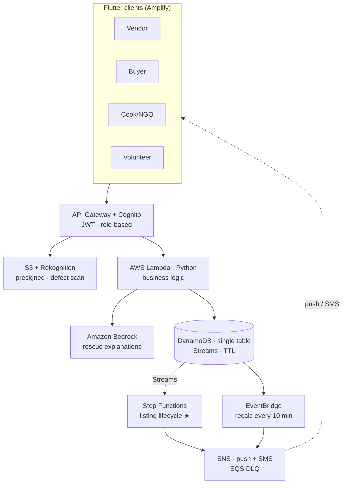

<div align="center">

# 🌱 Revivo

### A Time-Aware Food Recovery Network

**AI-powered surplus redistribution — Sell → Rescue → Transform**

*Technology races against the clock to save the food. Community turns saved food into a warm meal. Revivo does both.*

AWS Student Builder Group Hackathon 2026 · `#include 1.0` · Track: **SDG 2 — Zero Hunger & Sustainable Agriculture**

</div>

---

## 📖 Overview

**Revivo** connects vegetable vendors with nearby hotels, restaurants, NGOs, temple kitchens, and community cooks. It treats every batch of surplus produce as a **degrading asset with a live countdown** and automatically decides whether its highest value lies in **selling** it, **rescuing** it, or **transforming** it into a hot meal.

The platform operates through three automated layers, each triggered by a freshness countdown:

| Layer | What happens | Trigger |
|-------|--------------|---------|
| **1 · Sell** | Vendor photographs surplus → Rekognition IDs it & screens for defects → freshness band + price → matched to nearby buyers | Vendor lists produce |
| **2 · Rescue** | When a listing stays unsold and freshness hits the *Rescue* band, the system auto-routes it to a matched receiver | Unsold 4h+ **and** Rescue band |
| **3 · Transform** | Community Cooking Circles (temple kitchens, hostel messes, NGOs) turn rescued produce into meals | Receiver accepts rescue |

Pilot: **Gandhipuram Market, Coimbatore** — 15 vendors, 10 hotels, 1 temple kitchen, a local NSS unit as pickup partner.

## ❗ Problem statement

India wastes **67 million tonnes of food annually** while **190 million people go hungry**. Vegetables lead the waste because of their short shelf life, and it starts with the last-mile vendor. Every evening, vendors discard edible produce while hotels 1–2 km away buy the same vegetables at full price — unaware surplus exists nearby. Existing platforms are static bulletin boards: they ignore perishability, don't escalate when selling fails, and never ensure rescued produce becomes a meal. **This is not a marketplace problem — it is a timing problem.**

## 💡 Solution

Revivo adds **time-awareness, automation, and measurement** to surplus redistribution:

- **Live freshness bands** (Good / Use Soon / Rescue) from a validated shelf-life database adjusted for storage condition and local temperature — honest ranges, not false precision.
- **Relevance-scored matching** (proximity 40%, purchase history 30%, quantity match 20%, rating 10%) with aggregated buyer views ("18 kg tomatoes from 3 vendors within 1.5 km").
- **Autonomous Food Rescue Mode** with matching filters (operating hours, reliability, vegetable preference, freshness window).
- **Bedrock-generated explanations** at every rescue trigger — human-readable reasoning.
- **Impact tracking & gamification** — personal impact cards, community leaderboard, milestone badges, all sourced from FAO/UNEP factors.

## ✨ Features

- 40-second vendor listing flow (photo → AI ID + defect scan → band → price → publish, < 3s end-to-end)
- GPS + timestamp verified photos (5-layer trust model + Trusted Vendor badge)
- Buyer dashboard with nearby + aggregated listings and one-tap ordering
- Visible **Step Functions listing lifecycle**: `ACTIVE → DISCOUNTED → RESCUE → RESCUED / EXPIRED`
- SMS-based cook workflow (Accept → Received → Meals Served) — no app install required
- Two-tap volunteer pickup (Picked Up → Delivered)
- Real-time impact dashboard + leaderboard + badges

## 👥 User roles (4 logins)

| Role | Capabilities |
|------|--------------|
| **Vendor / Seller** | List surplus, manage inventory, approve orders, view impact & insights |
| **Buyer / Hotel** | Browse nearby & aggregated listings, one-tap order, track orders |
| **Cook / NGO** | Receive rescues (app or SMS), Accept → Received → Meals Served, view impact |
| **Volunteer (NSS)** | Pickup coordination — Picked Up → Delivered |

All four use **one Amazon Cognito user pool** with a `custom:role` attribute for zero-code role-based access.

## 🧱 Technology stack

| Layer | Technology |
|-------|------------|
| **Frontend** | Flutter (Dart) + Riverpod · hosted on AWS Amplify |
| **Backend** | Serverless — API Gateway + AWS Lambda (Python 3.12) |
| **Database** | Amazon DynamoDB (single-table) + Streams + TTL |
| **Auth** | Amazon Cognito (JWT, role-based access) |
| **AI pipeline** | Rekognition (ID + defect) → Lambda → Bedrock → DynamoDB |
| **Events / orchestration** | DynamoDB Streams + EventBridge + Step Functions |
| **Notifications** | Amazon SNS (push + SMS) + SQS dead-letter queue |
| **Storage** | Amazon S3 (presigned URLs + SSE encryption) |
| **Observability** | Amazon CloudWatch |
| **Infrastructure as Code** | AWS CDK (Python) |

## 🗺️ Architecture

See [`docs/architecture.md`](docs/architecture.md) and the diagram at [`docs/architecture.png`](docs/architecture.png).



## 📂 Repository structure

```
revivo/
├── infra/      # AWS CDK (Python) — all cloud resources, one `cdk deploy`
├── backend/    # Lambda handlers (Python) + shared modules
├── app/        # Flutter app (Riverpod) — 4 role experiences
├── seed/       # demo data scripts (vendors, buyers, cooks, listings)
├── docs/       # architecture, API spec, demo script, ADRs
└── .github/    # CI workflows
```

## 🚀 Setup & installation

### Prerequisites
- Flutter 3.44+ / Dart 3.12+
- Python 3.11+ and Node.js 18+
- AWS account with credentials configured (`aws configure`)
- AWS CDK CLI: `npm install -g aws-cdk`

### 1. Clone & configure
```bash
git clone https://github.com/smriti51818/Revivo.git
cd Revivo
cp .env.example .env   # fill in values after deploy
```

### 2. Deploy the backend (AWS CDK)
```bash
make infra-deploy      # cdk bootstrap + deploy all stacks
make seed              # load demo vendors, buyers, cooks, and listings
```
The deploy outputs (API URL, Cognito IDs, S3 bucket) are written for the app to consume.

### 3. Run the Flutter app
```bash
make app-run           # runs on connected device / web
make app-build-apk     # builds a release APK
```

> Full command reference: run `make help`.

## 🕹️ Usage guide

1. **Sign up / log in** and pick a role (Vendor, Buyer, Cook, Volunteer).
2. **Vendor:** tap *Add Listing* → capture a photo → confirm the AI-identified vegetable, purchase date, and storage → publish.
3. **Buyer:** browse nearby & aggregated listings → open a product → one-tap order.
4. Watch the listing move through **ACTIVE → DISCOUNTED → RESCUE** in the AWS Step Functions console.
5. **Cook:** accept an incoming rescue (or via SMS), mark *Received*, enter *Meals Served*.
6. See impact cards and the leaderboard update in real time.

## 📦 Deliverables
- ✅ Source code (this repo)
- ✅ Architecture diagram — [`docs/architecture.png`](docs/architecture.png)
- ✅ Demo script — [`docs/demo-script.md`](docs/demo-script.md)
- 🔗 Deployment link (Amplify) — *added after deploy*
- 🎬 Demo video (YouTube) — *added after demo*

## 🔭 Future scope
Compost/processor routing · live Agmarknet price feed · multi-vendor route optimization · weather-based demand forecasting · carbon credit tracking · DynamoDB DAX · delivery API integration (Dunzo/Porter) · payment gateway · full AI freshness modeling.

## 👩‍💻 Team Neura
- **Smriti T M** (Lead) — smriti51818@gmail.com
- **Pooja S** — poojasivaramalingam15@gmail.com
- **Thaenmozhi A** — thaenmozhi14122005@gmail.com

## 📄 License
Released under the [MIT License](LICENSE). Open-source dependencies retain their respective licenses.
